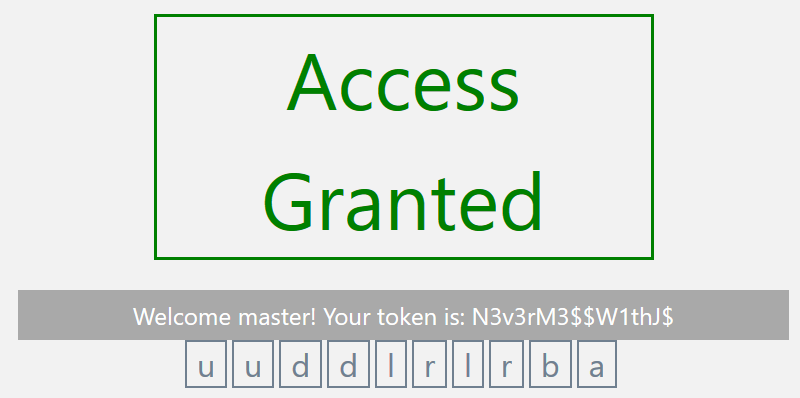
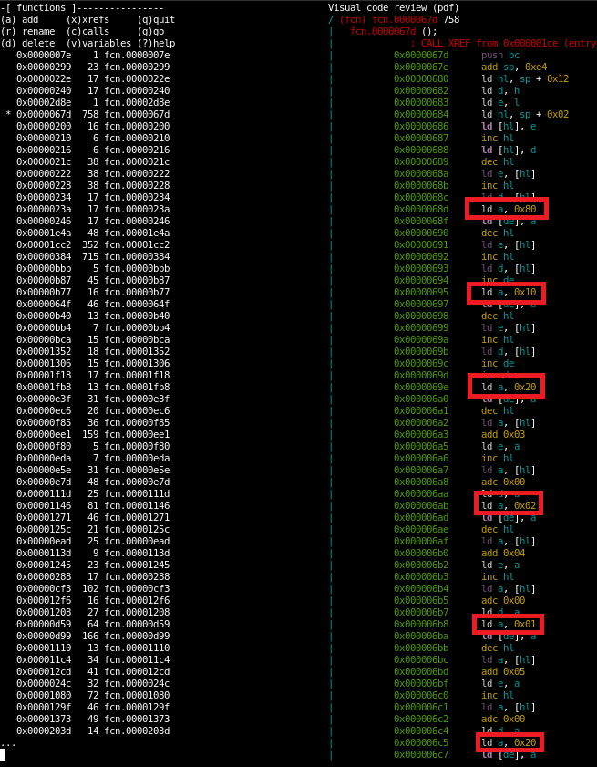
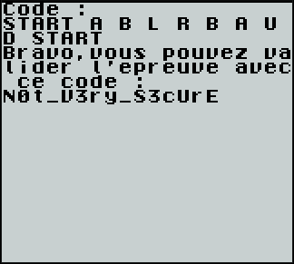
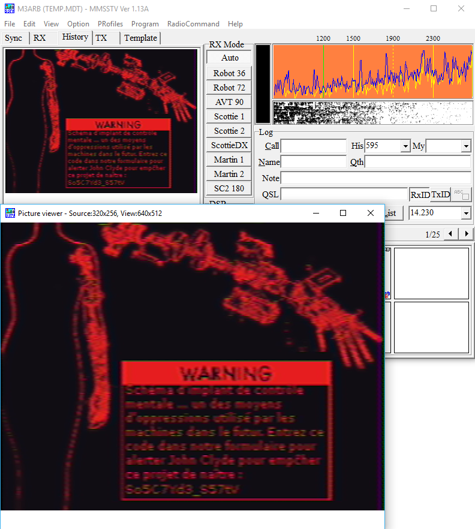
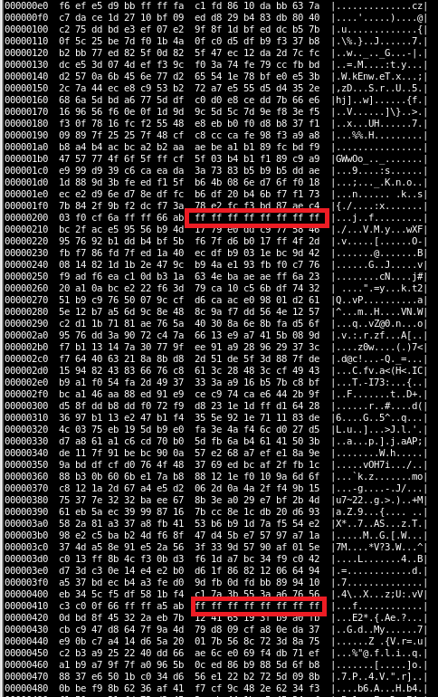

# Write-up du challenge Cyberpunk2048 (I-Tracing, Nuit du Hack XVI)

## #1 Unlock the console

Cette première épreuve consiste à entrer une séquence "magique" pour débloquer le flag.

Lorsqu'on lit le code source, on s'aperçoit que quelque chose est chiffré : 

    var encrypted = "U2FsdGVkX18SqdsRePyGTOKokiklCRXXuFHR2dpt1fkioRPie5eQa4bjV91bZuW4c+QLdtNYfHGEcP95Op4j8w==";
    
    var decrypted = CryptoJS.AES.decrypt(encrypted, "Cecin'estpasleflagmaisjusteunecledechiffrementtresforteoupas");

Pour le reste le code JavaScript lit une séquence de touches en suivant le pattern suivant : 

    var theCode = ['u', 'u', 'd', 'd', 'l', 'r', 'l', 'r', 'b', 'a'];

On s'aperçoit assez vite qu'il s'agit du Konami Code.

Lorsqu'on entre celui-ci au clavier, on obtient le message suivant :

**Note :** il est aussi possible de lire le contenu de la variable decrypted directement à partir de la console du navigateur.

## #2 NAAAaaaaaaAAAAN !

Une image gif nous est donnée. On remarque très vite la présence de texte dans celle-ci.

Une image gif animée n'étant qu'une succession d'images, il suffit de la décomposer dans toutes ces images successives (penser à installer imageio) : 

    import imageio
    
    reader = imageio.get_reader('feb67028-0283-4b.gif')
    for i, im in enumerate(reader):
        imageio.imsave("nan-%i.png" % i, im)
        print('Frame %i' % i)

On peut donc lire le texte de la 7ème frame : 

On aurait aussi pu utiliser des yeux de ninja ;-)

## #3 ASCII paraît, Cesar ...

Le jeu de mots douteux nous annonce tout de suite la couleur. Nous avons affaire à du César.

Mais pas celui dont nous avons pris l'habitude puisque le fichier est binaire...

L'autre partie du titre nous donne la réponse. L'ensemble du César est la table ASCII (non étendue) qui est codée sur 7 bits, donc 128 possibilités.

En réalisant une analyse fréquentielle on obtient : 

    {239: 1, 187: 1, 191: 1, 119: 2, 36: 77, 35: 97, 31: 3, 42: 52, 39: 77, 97: 10, 63: 10, 127: 2, 26: 180, 85: 203, 40: 79, 30: 83, 118: 8, 22: 67, 124: 1, 33: 58, 43: 24, 34: 23, 23: 10, 25: 36, 92: 18, 5: 4, 4: 2, 7: 3, 126: 2, 93: 1, 24: 48, 41: 62, 28: 8, 27: 12, 94: 1, 99: 14, 11: 2, 47: 4, 37: 28, 38: 13, 103: 3, 101: 5, 105: 1, 109: 1, 8: 4, 29: 10, 86: 2, 1: 1, 45: 4, 9: 1, 111: 3, 46: 3, 98: 1, 122: 2, 120: 1, 106: 1, 20: 2, 123: 1, 108: 1, 10: 1}

On voit que le caractère le plus courant est celui ayant le code 85. Ce caractère correspond au caractère espace (en clair), le plus courant dans un texte écrit en ASCII.

On en déduit donc un décalage de 53, ce qui est équivalent à un décalage de 75 dans l'autre sens.

Le script Python complet (avec analyse fréquentielle et déchiffrement) :

    inputFile = open("communication_vBZvcbm.txt", "rb")
    inbuffer = inputFile.read()
    
    freqChars = {}
    for char in inbuffer:
        if char not in freqChars.keys():
            freqChars[char] = 1
        else:
            freqChars[char] += 1
    print(freqChars)
    
    outbuff = ""
    for char in inbuffer:
        outbuff += chr((char-53)%128) # ou chr((char+75)%128)
    
    print(outbuff)

On obtient le texte : 

    Bonjour,
    Je suis Anna Gonsalves, membre d'APORIA (Alliance de PrOtection contRe les Intelligences Artificielles). Vous ne connaissez probablement pas cette organisation et cela est normal ... elle n'a ete cree qu'en 2048.
    Si vous ne participez pas a ce challenge, voila ce qu'il va se passer !
    Les intelligences artificielles ont pris le controle du monde et ont decide d'exterminer l'humanite.
    Tout a commence en 2020, avec l'arrive d'une toute nouvelle facon de concevoir les intelligence artificielles. Pour que ces dernieres comprennent notre monde, des gigantesques fichiers ont servi de base a ces dernieres pour leur apprendre l'histoire de la planete.
    Son objectif : sauver l'environnement. Pour chaque donnee historique, il y avait des indicateurs associes indiquant les impacts sur la nature, la biodiversite.
    Apres des annees et des annees d'apprentissage, celle-ci trouva un moyen pour le moins radical de resoudre ces problemes : exterminer l'humanite pour mieux se concentrer sur la reparation de l'environnement. Et nous devons bien admettre qu'elle n'est pas loin d'avoir rempli tous ses objectifs.
    
    Enfin bref, nous n'avons pas pu trouver Sarah Connor donc on va dire que vous ferez l'affaire, quiconque que vous soyez. Je vous expliquerai plus tard la suite de notre histoire.
    Voici le code pour continuer votre mission : S05_Fu7Ur_Ap0RiA
    Bonne chance !

## #4 Où se trouve la tour Eiffel ?

Là encore le titre est évocateur et on cherche vraisemblablement une localisation.

Le premier réflexe lorsqu'on cherche la localisation d'une image est de consulter les métadonnées exif. Pour ce faire on peut notamment utiliser exiftool : 

    exiftool weird_human_tower.jpg

Il n'y a pas de donnée particulière dans le champ réservé aux informations de localisation. En revanche le champ sub-location contient les informations suivantes : *28.562017, -80.577206*

En tapant ces coordonnées dans Google Maps, on obtient un point correspondant à un lieu : **SpaceX Launch Complex 40**

## #5 Une image qui retourne le cerveau !

De la stéganographie de haut niveau ? Que nenni !

En faisant un strings sur le fichier, on s'aperçoit que tout n'est pas binaire... En particulier, la chaîne suivante en ressort : 

    ++++++++++[>+>+++>+++++++>++++++++++<<<<-]>>>+++++++.>+++++++++++++++++++++.<++++++++++++++++++.-----------------------------.>-------.<--------------.>---------.<++++++++++++++++++++++++++.>----------.--------.++++++++++++++++++.+++.<-----------------------.>-------------.<----.>+++++++++++++++++++++++++.------------.<---.>--------.+.

Il s'agit de brainfuck que lorsqu'on décode avec l'interpréteur approprié donne : 

    My_Br4iN_Wil7_3xl0de

## #6 Lire entre les lignes

Lorsqu'on lit le code source du fichier html fourni la première chose frappante est son indentation étrange.

En cherchant un peu ce qu'il est possible de coder avec des caractères blancs on trouve un autre langage de la même trempe que le brainfuck : le Whitespace.

En décodant on trouve rapidement : 

    Inv1siBl3_Pr0gram1nG_L4nGuaG3

## #7 Encore une image !

On peut visuellement constater que l'image a été altérée. Il reste à déterminer comment.

Pour ce faire on peut prendre chacun des canaux et observer l'image résultante : 

On s'aperçoit donc que le canal rouge est resté inchangé. Seuls les canaux vert et bleu ont été touchés.

La technique du LSB ne donnant en général pas de résultat visible, ou peu, on peut supposer qu'on a là l'inverse avec une stéganographie de type MSB.

On peut donc écrire un script d'export (ici en Python) :

    from PIL import Image
    im = Image.open("from_future_import_love.bmp")
    
    red = im.getdata(0)
    green = im.getdata(1)
    blue = im.getdata(2)
    
    j = 0
    output = ""
    workbyte = 0
    for i in range(0,len(red)):
        if j % 8 == 0:
            if workbyte >= 32 and workbyte <= 126:
                output += chr(workbyte)
            workbyte = 0
        workbyte += (0x01 << (7-j%8))*((green[i]&0x80)>>7)
        j += 1
        workbyte += (0x01 << (7-j%8))*((blue[i]&0x80)>>7)
        j += 1
    
    print(output)

En particulier, on récupère sous forme de tableau linéaire (flattened) chaque canal puis on extrait des canaux vert et bleu les MSB pour les aligner dans la sortie.

Ici on travaille octet par octet en assemblant chaque bit récupéré, j étant la position courante du bit dans l'octet et i étant la position dans l'image. Petit bonus : on vérifie ici que l'octet obtenu est printable ce qui permet d'éviter de pourrir sa console étant donnée que toute l'image n'est pas codée.

Concernant l'opération bit à bit : 

* (0x01 << (7-j%8)) : c'est la puissance de 2 par laquelle on va multiplier pour placer le bit au bon endroit dans l'octet résultant
* ((green[i]&0x80)>>7) : on extrait le bit de poids fort en réalisant un masque (pas obligatoire mais pour être sûrs...) puis un décalage à droite pour pouvoir travailler avec un unique bit.

On récupère le texte suivant : 

    Chef, les IA ont regroupe plusieurs serveurs de base de donnees dans des immeubles en peripherie du complexe. Nous avons trouve une prise permettant de nous connecter a l'exterieur de ceux-ci. Mais les patrouilles sont nombreuses et nous avons du laisser tomber. Nous guettons et attendons le moment opportun pour y retourner.Si jamais il nous arrivait un quelconque probleme, voici le mot de passe de leur acces telnet que nous avons reussi a capturer sur le reseau : M4ch1nes_r0ck_3Xt3rm1n4te_4ll_Hum4nsCa ne s'invente pas... Visiblement on ne leur a toujours pas apprit les vraies bases.J'espere vous revoir bientot.Takeshi Kovacs, fin de transmission.

## #8 Obfuscate like a boss

Commencer par décoder les chaînes de caractères qui se présentent sur plusieurs formes : 

* Encodées : '\x59\x6a\x69\x54\x67'
* Placés dans des tableaux : [0x66, 0x6c, 0x61, 0x67]
* Obfusquées par une fonction : _0x503b('0x4')

Pour ce dernier cas, détailler le fonctionnement de la fonction de décodage et l'interpréter pour désobfusquer les chaînes. Ne pas hésiter à renommer les fonctions dès que le rôle est connu.

La console du navigateur peut également accélérer la compréhension (attention à n'y coller que du code compris ;-) ).

Par exemple voici la fonction de décodage simplifiée et explicitée : 

    var obfs_strings= [
    '\x62\x47\x56\x75\x5a\x33\x52\x6f',
    '\x63\x33\x56\x69\x63\x33\x52\x79',
    '\x55\x47\x56\x79\x5a\x48\x55\x67\x4c\x69\x34\x75\x49\x45\x56\x7a\x63\x32\x46\x70\x5a\x53\x42\x6c\x62\x6d\x4e\x76\x63\x6d\x55\x67\x4f\x79\x6b\x3d',
    '\x4e\x54\x59\x77',
    '\x61\x47\x56\x70\x5a\x32\x68\x30',
    '\x59\x58\x42\x77\x5a\x57\x35\x6b\x51\x32\x68\x70\x62\x47\x51\x3d',
    '\x62\x47\x56\x6d\x64\x41\x3d\x3d',
    '\x63\x6d\x6c\x6e\x61\x48\x51\x3d',
    '\x61\x32\x56\x35\x5a\x47\x39\x33\x62\x67\x3d\x3d',
    '\x64\x55\x35\x73\x53\x45\x49\x3d',
    '\x5a\x32\x56\x30\x52\x57\x78\x6c\x62\x57\x56\x75\x64\x45\x4a\x35\x53\x57\x51\x3d',
    '\x5a\x6e\x4a\x76\x62\x55\x4e\x6f\x59\x58\x4a\x44\x62\x32\x52\x6c',
    '\x59\x58\x42\x77\x62\x48\x6b\x3d',
    '\x64\x56\x4e\x49\x62\x32\x38\x3d',
    '\x59\x32\x39\x75\x59\x32\x46\x30'
    ];

    var nombre_tours = 0x128;

    // Cette partie "mélange" les entrées du tableau initial (contenant les strings obfusquées) sur 127 tours
    while (--nombre_tours) {
        obfs_strings.push(obfs_strings.shift());
    }

    var decode = function(input_text) {
        var work_string = obfs_strings[input_text];
        // Détection du premier lancement de la fonction
        if (decode['Qvcyjk'] === undefined) { 
            (function() {
                var alphabet = 'ABCDEFGHIJKLMNOPQRSTUVWXYZabcdefghijklmnopqrstuvwxyz0123456789+/=';
                // Surcharge de la fonction atob (encodage en base64 JavaScript)
                window['atob'] || (window['atob'] = function(input_text) {
                    var _0x4dc542 = String(input_text).replace(/=+$/, '');
                    // Boucle de désobfuscation volontairement complexe, plus facile à exécuter qu'à lire
                    for (var i = 0, _0x57de8a, _0x41d3ce, char_pos = 0, output = ''; _0x41d3ce = _0x4dc542['charAt'](char_pos++); ~_0x41d3ce && (_0x57de8a = i % 4 ? _0x57de8a * 0x40 + _0x41d3ce : _0x41d3ce, i++ % 0x4) ? output += String['fromCharCode'](0xff & _0x57de8a >> (-0x2 * i & 0x6)) : 0x0) {
                        _0x41d3ce = alphabet.indexOf(_0x41d3ce);
                    }
                    return output;
                });
            }());
            // La véritable fonction de décodage, basée sur l'initialisation précédente, est ici
            decode['DCtbiS'] = function(encoded) {
                var output_bin = atob(encoded);
                var output = [];
                for (var i = 0; i < output_bin.length; i++) {
                    output += '%' + ('00' + output_bin.charCodeAt(i).toString(0x10)).slice(-2);
                }
                return decodeURIComponent(output);
            };
            decode['BMtkLX'] = {}; // Cache : les strings décodées ne le seront pas 2 fois
            decode['Qvcyjk'] = true; // Pour éviter de revenir à l'initialisation la prochaine fois
        }
        var cache = decode['BMtkLX'][input_text];
        if (cache === undefined) {
            work_string = decode['DCtbiS'](work_string); // Décodage
            decode['BMtkLX'][input_text] = work_string;
        } else {
            work_string = cache;
        }
        return work_string;
    };

En décodant les strings on remarque deux fonctions particulières : 

    function ______________() {
        var _0x1c567d = {};
        _0x1c567d['2'] = String['fromCharCode'][decode('0x2')](null, "Vr4im3nT");
        _0x1c567d['1'] = String['fromCharCode']['apply'](null, "0bfuSc4t10n");
        _0x1c567d['3'] = String['fromCharCode'][decode('0x2')](null, "1nuTilE");
        return _0x1c567d;
    }

    function ________(_0x22688d) {
        __________ = ______________();
        if (_0x22688d === __________['1']['concat'](String['fromCharCode']['apply'](null, '_'))['concat'](__________['2']['concat'](String['fromCharCode']['apply'](null, '_'))['concat'](__________['3']))) {
            alert('Bravo, vous avez trouvé le flag !');
        } else {
            alert('Perdu ... Essaie encore ;)');
        }
    }

On peut donc assez aisément reconstituer le flag : **0bfuSc4t10n_Vr4im3nT_1nuTilE**

## #9 Kill RSA

On se doute vu le titre qu'il s'agit ici d'attaquer RSA. Les attaques les plus connues se basent sur la factorisation lorsque d est faible et lorsque p et q sont trop proches.

L'une de ces attaques s'appelle l'attaque de Wiener.

Le principe de RSA repose sur des notions arithmétiques relativement simples. On vous laisse les découvrir ici si vous ne les connaissez pas : [Wikipedia !](https://fr.wikipedia.org/wiki/Chiffrement_RSA)

L'attaque de Wiener suppose des connaissances arithmétiques un peu plus fortes : [Attaque de Wiener](http://www.jannaud.fr/static/download/Travail/rapportwiener.pdf)

Des implémentations de l'algorithme décrit dans le papier précédent existent, comme par exemple [RSA Wiener Attack](https://github.com/pablocelayes/rsa-wiener-attack)

Avec la bibliothèque précédente, on peut en quelques lignes de Python, retrouver la clé privée *d* : 

    from RSAwienerHacker import hack_RSA
    hack_RSA(0x3211bdccc460700cc89c1b28346142903b14ce10d70b529bf753dbbe2c377361231e522b568a3b2775ba9cd0d1e976028ac689d2611c6e79cc36fbafea6e078948fd3148c990b9b54d9588a8d164ec2be21096975227d3cd24d181bc64117a38381c4dcda369034d0bce062cc161e8ef58f0b34a85d86409afe44260dae1ea9,0x23d1400a2e5bb02bbeb387e16e4a61f5b68e3e4cdf4849a571d20c5a02dde6bdfa2b583ccbed944926b18c44671b48cf98a59ad6310f2e4978422159812e5caffff5df4e31cef296f3a16bb9d74e72fcb8840ffd3a89cca4b3186b3d1c76ed878430909b1a71f2b981a926d12a6acabad9bd369309b79a0e20a855a3f5cbd615)
    Hacked!
    8635702660897690847732734825964369544528779188079861128057846799711611513625

Il suffit ensuite de déchiffrer le message avec RSA, toujours en Python (what else ?) :

    d = 0x1317a26e40cacc70ed9e99d87785ee0e33bc965a3bd1bf407d2a934090c5eb19
    n = 0x23d1400a2e5bb02bbeb387e16e4a61f5b68e3e4cdf4849a571d20c5a02dde6bdfa2b583ccbed944926b18c44671b48cf98a59ad6310f2e4978422159812e5caffff5df4e31cef296f3a16bb9d74e72fcb8840ffd3a89cca4b3186b3d1c76ed878430909b1a71f2b981a926d12a6acabad9bd369309b79a0e20a855a3f5cbd615
    # Pour transformer le message en numérique, simplement le réécrire comme un grand nombre : 0x0f 0x37 devient 0x0f37
    m = 0x0f37f49a9da0666181921fc06d6a50469ea70f2c8a504ef8cc877a3205b4708b0f2ce224803a887d55a27210c7bad0900d3c4e606593304e6b7ae883c238deb02ffaf180f4dfb2c5986f0bd7a4fd8dc9c951e9b4b88dd8fbe2ec8661f3ff1286325b30bb0d44433b3110581465e332073e73a40f0c0ed7944392212311226175
    # Là c'est la magie du déchiffrement RSA, juste une exponentiation modulaire à faire
    c = pow(m, d, n)
    # Et l'opération pour obtenir l'ASCII à partir de c (le clair en RSA) est identique
    clair = "%x" %c
    outstring = ""
    for i in range(0, len(clair), 2):
        outstring += chr(int(clair[i:i+2], 16))
    print(outstring)
    'Le flag de ce challenge est : W3aK_G3nEr4T1oN_KeY'

Et voilà enfin le flag :)

## #10 ERROR TRANSMISSION CORRUPTED

Encore du code obfusqué ! Mais du VBA ce coup-ci ;)

On peut l'aborder sous le même angle d'attaque que le JavaScript obfusqué : chercher la fonction d'obfuscation des chaînes de caractères et la détourner pour les décoder.

Ici on voit régulièrement revenir la fonction *dvapwxazibct* avec une chaîne de caractères. Il y a donc de bonnes chances qu'elle soit la fonction que nous cherchons. Celle-ci paraît d'ailleurs plus simple que la précédente : 

    Private Function dvapwxazibct(ByVal krswpdvucptu As String) As String
    Dim ybbiawlzrtqg As Long
    For ybbiawlzrtqg = 1 To Len(krswpdvucptu) Step 2
    dvapwxazibct = dvapwxazibct & Chr$(Val("&H" & Mid$(krswpdvucptu, ybbiawlzrtqg, 2)))
    Next ybbiawlzrtqg
    End Function

On peut directement l'exécuter en VBA mais comme on a dit qu'on aimait le Python : 

    def decode(input_string):
        output_string = ""
        for pos in range(0, len(input_string), 2):
            output_string += chr(int(input_string[pos:pos+2], 16))
        return output_string

Cette fonction nous décode donc la majorité des chaînes de caractères... Mais pas encore de flag en vue. Il va falloir mieux comprendre ce qu'il se passe.

Tout d'abord on constate que le script détermine l'OS sur lequel il est exécuté et ne continue son exécution que s'il est sur Windows (voir la subroutine *dorteiungrmoh* lancée par *AutoOpen*).

On entre juste après dans *iprzlxwxmlbuuoieswvf* qui accède à un fichier : Temp\\WINWORD.EXE_c2rdll(12345678909876543).log

On contrôle s'il existe et si ce n'est pas le cas, on le crée et on y écrit la chaîne de caractères : MDIyOUE3QTRDRDUyMDYyRDk0ODBGQjREQkU0MUQ0MUE

Les fois suivantes où la macro est exécutée, on vide le fichier. Cette chaîne de caractères est donc d'intérêt et de manière assez évidente on remarque de l'encodage en base64, qu'on s'empresse donc de décoder : 0229A7A4CD52062D9480FB4DBE41D41A

En faisant une recherche sur cette chaîne on trouve rapidement qu'il s'agit d'un hash NTLM et qu'il correspond au mot de passe *p@ssw0rd!*

On valide avec ce flag.

## #11 Let's crack my childhood

Ici le type de fichier ne fait pas de secret : 

    file 831555b5-ed6e-46.gb 
    831555b5-ed6e-46.gb: Game Boy ROM image: "CHALL" (Rev.01) [ROM ONLY], ROM: 256Kbit

Il s'agit d'une ROM de programme GameBoy. On peut donc prendre un émulateur, comme VisualBoyAdvance (disponible dans les dépôts Kali), pour exécuter cette ROM. On obtient l'écran suivant : 

Il va donc falloir réaliser un reverse engineering de la ROM pour déterminer quel est le code.

Pour ce faire lançons radare2 : 

    radare2 831555b5-ed6e-46.gb

Premièrement récupérons tous les flags, pour nous aider un peu dans la suite : 

    [0x00000100]> aaa
    [x] Analyze all flags starting with sym. and entry0 (aa)
    [ ] 
    [Value from 0x00000000 to 0x00008000
    aav: 0x00000000-0x00008000 in 0x0-0x8000
    [x] Analyze len bytes of instructions for references (aar)
    [x] Analyze function calls (aac)
    [x] Use -AA or aaaa to perform additional experimental analysis.
    [x] Constructing a function name for fcn.* and sym.func.* functions (aan)

Repérons le point d'entrée du programme et plaçons-nous y : 

    [0x00000100]> ie
    [Entrypoints]
    vaddr=0x00000100 paddr=0x00000100 baddr=0x00000000 laddr=0x00000000 haddr=0x00000100 type=program
    
    1 entrypoints
    
    [0x00000100]> s 0x100

Le code est entré à partir du Joypad. En consultant la référence de reverse engineering de la GameBoy ([Everything You Always Wanted To Know About GAMEBOY](http://web.textfiles.com/games/gbspec.txt)), on constate que la fonction d'écoute du Joypad écrit à 0xff00. Cherchons les références : 

    [0x00000100]> pd 8000 | grep ff00
    |      ::   0x00000193      e2             ld [0xff00 + c], a
         ||:|   0x00000ae4      e000           ld [0xff00], a              ; JOYPAD
    |    || |   0x00000b8a      e000           ld [0xff00], a              ; JOYPAD
    |    || |   0x00000b8c      f000           ld a, [0xff00]              ; JOYPAD
    |    || |   0x00000b8e      f000           ld a, [0xff00]              ; JOYPAD
    |    || |   0x00000b98      e000           ld [0xff00], a              ; JOYPAD
    |    || |   0x00000b9a      f000           ld a, [0xff00]              ; JOYPAD
    |    || |   0x00000b9c      f000           ld a, [0xff00]              ; JOYPAD
    |    || |   0x00000b9e      f000           ld a, [0xff00]              ; JOYPAD
    |    || |   0x00000ba0      f000           ld a, [0xff00]              ; JOYPAD
    |    || |   0x00000ba2      f000           ld a, [0xff00]              ; JOYPAD
    |    || |   0x00000ba4      f000           ld a, [0xff00]              ; JOYPAD
    |    || |   0x00000baf      e000           ld [0xff00], a              ; JOYPAD
                0x00002078      f000           ld a, [0xff00]              ; JOYPAD
            |   0x00002082      e000           ld [0xff00], a              ; JOYPAD
            |   0x00002084      f000           ld a, [0xff00]              ; JOYPAD
            |   0x00002086      f000           ld a, [0xff00]              ; JOYPAD
            |   0x00002090      e000           ld [0xff00], a              ; JOYPAD
            |   0x00002094      e000           ld [0xff00], a              ; JOYPAD
            |   0x00002096      f000           ld a, [0xff00]              ; JOYPAD
            |   0x00002098      f000           ld a, [0xff00]              ; JOYPAD
            |   0x0000209a      f000           ld a, [0xff00]              ; JOYPAD
            |   0x0000209c      f000           ld a, [0xff00]              ; JOYPAD
            |   0x0000209e      f000           ld a, [0xff00]              ; JOYPAD
            |   0x000020a0      f000           ld a, [0xff00]              ; JOYPAD
            |   0x000020a4      e000           ld [0xff00], a              ; JOYPAD
            |   0x000020a6      f000           ld a, [0xff00]              ; JOYPAD
    [autres résultats non pertinents]

Nous pouvons remarquer que le registre d'entrée/sortie joypad n'est chargé qu'avec le registre *a* en argument.
Passons en mode visuel à l'aide de la commande *vv* pour effectuer des recherches sur la liste des fonctions trouvée plus tôt. Il est probable que le code soit contrôlé dans une seule fonction, si on voit des chargements réguliers dans le registre a on aura de bonnes chances d'obtenir le code.

Une fonction en particulier remplit bien ce critère (fcn.0000067d) :

On quitte donc le mode visuel avec *qq* et on se place à l'adresse de cette fonction pour la désassembler et on se concentre sur les chargements de constantes dans *a* : 

    [0x00000100]> s 0x067d
    [0x0000067d]> pdf
    / (fcn) fcn.0000067d 758
    |   fcn.0000067d ();
    |              ; CALL XREF from 0x000001ce (entry0)
    [etc]
    |           0x0000068d      3e80           ld a, 0x80
    [etc]
    |           0x00000695      3e10           ld a, 0x10
    [etc]
    |           0x0000069e      3e20           ld a, 0x20
    [etc]
    |           0x000006ab      3e02           ld a, 0x02
    [etc]
    |           0x000006b8      3e01           ld a, 0x01
    [etc]
    |           0x000006c5      3e20           ld a, 0x20
    [etc]
    |           0x000006d2      3e10           ld a, 0x10
    [etc]
    |           0x000006df      3e04           ld a, 0x04
    [etc]
    |           0x000006ec      3e08           ld a, 0x08
    [etc]
    |           0x000006f9      3e80           ld a, 0x80
    [etc]

On s'arrête lorsqu'on a le bon nombre d'entrées nécessaires (10).

En lisant la documentation, on trouve les valeurs du registre 0xFF00 pour chaque type d'entrée : 

    0x80 - Start             0x08 - Down
    0x40 - Select            0x04 - Up
    0x20 - B                 0x02 - Left
    0x10 - A                 0x01 - Right

En faisant la correspondance, on trouve le code : 

    START A B LEFT RIGHT B A UP DOWN START

En entrant le code dans la ROM exécutée : 

On peut valider l'épreuve. Ouf !

## #12 Balayage d'informations

Dans cette épreuve, on ne nous donne presque pas d'information sur le fichier joint...

Tout d'abord un file nous donne l'information suivante : 

    file chall.png 
    chall.png: PNG image data, 590 x 350, 8-bit/color RGBA, non-interlaced

À priori on fait de nouveau face à un PNG classique. Mais rien n'est visible ce coup-ci...

Quelque chose d'intéressant se passe lorsqu'on fait un strings sur l'image : 

    strings chall.png
    [on s'en fiche]
    audio.mmv
    indice.jpg

En y regardant de plus près avec binwalk : 

    binwalk chall.png
    
    DECIMAL       HEXADECIMAL     DESCRIPTION
    --------------------------------------------------------------------------------
    0             0x0             PNG image, 590 x 350, 8-bit/color RGBA, non-interlaced
    99            0x63            Zlib compressed data, best compression
    439863        0x6B637         Zip archive data, at least v2.0 to extract, compressed size: 738886, uncompressed size: 1032196, name: audio.mmv
    1178788       0x11FCA4        Zip archive data, at least v2.0 to extract, compressed size: 10828, uncompressed size: 11192, name: indice.jpg 1189839       0x1227CF        End of Zip archive, footer length: 22

Si on ouvre le fichier PNG avec un gestionnaire d'archive, on récupère deux fichiers :

    unzip chall.png
    Archive:  chall.png
    warning [chall.png]:  439863 extra bytes at beginning or within zipfile
      (attempting to process anyway)
      inflating: audio.mmv
      inflating: indice.jpg

En ouvrant le fichier *indice.jpg* on voit la mention QSSTV. En faisant une recherche rapide, on découvre que le SSTV est une technique notamment utilisée par les radioamateurs pour transmettre de manière analogique des images sur un canal lent.

De l'autre côté, après quelques recherches, le fichier mmv s'avère être un fichier audio propre à certaines caméras Sony utilisant une compression MPEG-2.

Ici on fera le choix de le convertir en WAV à l'aide d'un petit utilitaire [disponible ici](http://hamsoft.ca/pages/extras-add-on/mmv2wav.php).

Une fois la conversion réalisée, on peut ouvrir le fichier audio converti avec un logiciel tel que MMSSTV : 

On arrive à lire le flag : **So5C7Yd3_S57tV**

## #13 Dump dump dump

Pour ce dernier challenge, tout repose dans les indications qui sont données.

On récupère un fichier gzippé qui, une fois décompressé, fait environ 17Mo.

Lorsqu'on fait un file dessus on s'aperçoit qu'il s'agit de données compressées en gzip : 

    file mysterious_dump.dmp 
    mysterious_dump.dmp: gzip compressed data, was "win.txt", last modified: Mon Jun 18 19:34:45 2018, from Unix

Mais voilà, impossible de le décompresser en l'état : 

    gzip -d mysterious_dump.dmp
    
    gzip: mysterious_dump.dmp.gz: invalid compressed data--format violated

binwalk ne nous aide pas beaucoup plus. Et lorsqu'on fait un hexdump sur le fichier on s'aperçoit que seule la première partie du fichier est utilisée et que le reste des 17 Mo est rempli de 0xFF.

Quand on regarde le fichier avec un éditeur hexadécimal, on s'aperçoit qu'une séquence se répète régulièrement : 

Ceci est inhabituel pour un fichier compressé qui a en général une très grande entropie.

D'après les indications de l'énoncé, on sait que le fichier provient d'un système embarqué et est un dump complet.

Lorsqu'on fait des recherches sur les systèmes embarqués, et en particulier les méthodes de stockage courantes, on en vient très vite au composant le plus courant du stockage persistent : la Nand Flash.

En se renseignant un peu sur le fonctionnement de la Nand Flash, on s'aperçoit que son manque de fiabilité est en général compensé par plusieurs mécanismes : 

* Fonctionnement par blocs (division élémentaire d'écriture) et Wear-Levelling pour équilibrer les écritures (qui se font en nombre limité, typiquement 100k)
* Ajout d'un espace out-of-band en fin de page (division élémentaire de lecture) contenant des informations à propos : 

     * Marquage des "bad blocks", les blocs défectueux sur lesquels on ne peut pas écrire
     * Insertion du résultat du calcul d'un code correcteur d'erreurs, permettant de corriger un certain nombre de "bit flips" lors de la lecture

Le noyau Linux propose un ensemble d'outils pour gérer les Nand Flash dans un système embarqué ou pour en simuler dans un environnement classique : **le sous-système MTD**.

Une documentation pour la simulation est disponible [ici](http://linux-mtd.infradead.org/faq/nand.html).

Par exemple, la plus petite mémoire flash Nand proposée dans les exemples du simulateur est de 16Mo. Cela correspond à notre dump tout simplement parce que la capacité affichée de la mémoire ne tient pas compte des zones out-of-band.

Dans le cas d'exemple de MTD, la capacité de stockage est de 16Mo répartie dans des pages de 512 octets avec des zones out-of-band de 16 octets.

Un rapide calcul donne donc une taille globale de 17 301 504 octets lorqu'on rajoute les informations out-of-band. C'est exactement la taille de notre fichier !

Simulons et programmons alors cette Nand : 

    # Création d'une Nand simulée de 16Mo avec des pages de 512 octets
    sudo modprobe nandsim first_id_byte=0x20 second_id_byte=0x33
    # On s'assure que la mémoire flash est bien vidée avant d'écrire, simple précaution
    sudo flash_erase /dev/mtd0 0 0 
    # Ecriture des données sur la mémoire flash simulée, on s'assure d'indiquer que nos données comportent des zones OOB et on désactive le calcul du code correcteur d'erreur (il est déjà dans notre dump)
    sudo nandwrite -n -o /dev/mtd0 mysterious_dump.dmp

Maintenant que notre Nand simulée est bien remplie, on veut récupérer les données brutes corrigées et sans les zones out-of-band. Et là surprise ! On s'aperçoit qu'il est nécessaire de faire des corrections. Le fichier était plein d'erreurs, seulement enlever les zones out-of-band n'aurait donc pas suffit ;)

    sudo nanddump -f final.dmp /dev/mtd0
    ECC failed: 0
    ECC corrected: 0
    Number of bad blocks: 0
    Number of bbt blocks: 0
    Block size 16384, page size 512, OOB size 16
    Dumping data starting at 0x00000000 and ending at 0x01000000...
    ECC: 1 corrected bitflip(s) at offset 0x00000000
    ECC: 1 corrected bitflip(s) at offset 0x00000200
    ECC: 1 corrected bitflip(s) at offset 0x00000400
    ECC: 1 corrected bitflip(s) at offset 0x00000600
    ECC: 1 corrected bitflip(s) at offset 0x00000800
    ECC: 1 corrected bitflip(s) at offset 0x00000a00
    [etc]

Essayons à nouveau de décompresser le fichier : 

    gzip -d final.dmp.gz 
    
    gzip: final.dmp.gz: decompression OK, trailing garbage ignored

C'est un succès ! Gzip nous indique seulement qu'il a ignoré les données en fin de fichier. Normal, puisque nous avons aussi récupéré les pages vides de la Nand : il suffit de voir tous les 0xFF en fin de fichier.

Contrairement au nom win.txt qui nous laissait supposer un fichier texte, un simple file sur le fichier résultant nous indique qu'il s'agit en réalité d'un fichier JPG.

On récupère ainsi le dernier flag pour terminer le Challenge I-Tracing de la Nuit du Hack XVI !

## Conclusion

Nous espérons que ce challenge vous a plu. Nous avons pris beaucoup de plaisir à le concevoir et à échanger avec vous tout au long du week-end (et après pour certains).

Nous félicitons les gagnants mais aussi tous les participants !

I-Tracing recrute ! N'hésitez pas à faire un tour sur nos réseaux : 

* Site web : https://www.i-tracing.com/fr/
* Twitter : [@I_Tracing](http://www.twitter.com/I_TRACING)
* Facebook : https://www.facebook.com/I-Tracing-790217024357511/
* LinkedIn : https://fr.linkedin.com/company/i-tracing

À l'année prochain à [LeHack.org](https://lehack.org/) !
